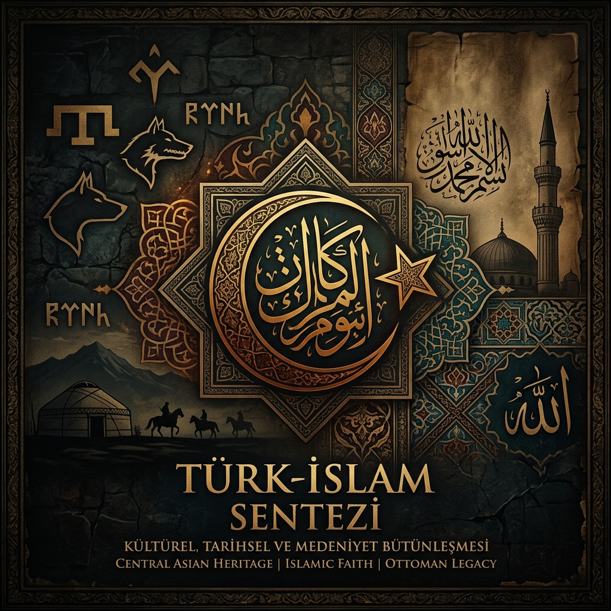

<div align="center">
  
  
  <h1>🌙 Türk-İslam Sentezi: Bir İdeolojinin Anatomisi ve Tarihsel Arşivi</h1>

  <p>
    
    
    
  </p>
</div>

---

Bu depo, Türkiye Cumhuriyeti'nin 20. yüzyıl siyasi ve kültürel hayatına damgasını vuran **"Türk-İslam Sentezi"** ideolojisinin köklerini, gelişimini, manifestolarını, yaşadığı iç çatışmaları ve nihayetinde bir devlet politikasına dönüşme sürecini belgelemek amacıyla oluşturulmuş açık kaynaklı bir tarih ve araştırma arşividir.

## 🏛️ Sentezin Üç Sütunu

Türk-İslam Sentezi, basit bir siyasi ittifak değil, üç ayrı tarihsel/kültürel katmanın bir araya getirilme çabasıdır:

- 🐺 **Sentezin I. Ayağı - Bozkır Kültürü ve Milli Öz:** Türklerin Orta Asya step medeniyetinden getirdiği devlet geleneği, teşkilatçılık dehası, savaşçı ruh ve cihan hakimiyeti ülküsü. Bu katman, Türklüğün biyolojik değil tarihsel ve kültürel kimliğini oluşturur.
- 🕌 **Sentezin II. Ayağı - İslam Ahlakı ve Manevi Zemin:** İslam'ın getirdiği adalet anlayışı, ümmet şuuru, ahiret sorumluluğu ve ahlaki disiplin. Bu katman, devletin ruhunu ve toplumun maneviyat çimentosunu oluşturur.
- ⚙️ **Sentezin III. Ayağı - Muasır Medeniyet:** Batı teknolojisini ve çağdaş devlet yönetiminin araçlarını özümsemek, ancak kültürel asimilasyona düşmemek. Bu katman, Ziya Gökalp'in *"Türkleşmek, İslamlaşmak, Muasırlaşmak"* üçlüsünden doğrudan devşirilmiştir.

> 💡 *"Türklük ile İslamlık arasındaki sentez; tez ve antitez çatışmasının değil, iki uyumlu unsurun tarih boyunca tabii bir seyirle kaynaşmasının ürünüdür. Türkler İslam'a büyük hizmetler yaptığı gibi, İslam da Türk kimliğinin korunmasını sağlamıştır."*  
> — **İbrahim Kafesoğlu** *(Türk-İslam Sentezi, 1985)*

---

## 📜 Dokuz Işık Doktrini: Türkeş'in Siyasi Manifestosu

Alparslan Türkeş'in MHP için geliştirdiği **"Dokuz Işık"** doktrini, Türk-İslam Sentezi'nin siyasi-pratik tercümesidir. Bu dokuz ilke; *Milliyetçilik, Ülkücülük, Ahlakçılık, Toplumculuk, İlimcilik, Hürriyetçilik ve Şahsiyetçilik, Köycülük, Gelişmecilik ve Endüstriyalcilik, Halkçılık* şeklinde sıralanmaktadır. Bu yapı, salt bir ırk söyleminin ötesinde sınıf çelişkisine devletçi yanıtlar arayan, köy kalkınmasını ön plana çıkaran ve maneviyatçı siyasi bir programa dönüştüren bütünlüklü bir devlet felsefesini yansıtmaktadır.

> 🇹🇷 *"Ülkücüler; milletimizin birliğini, yurdumuzun bütünlüğünü, devletimizin bağımsızlığını, dinimizin şerefini ve insanlığın mutluluğunu gerçekleştirme davasının fedakâr erleridir."*  
> — **Alparslan Türkeş**

---

## ⚖️ Eleştirel Perspektif: Bir Sentez mi, Yoksa Araçsallaştırma mı?

Her büyük ideolojik proje gibi Türk-İslam Sentezi de kendi içinde barındırdığı gerilimler ve dışarıdan gelen eleştirilerle yüzleşmek durumundadır. Bu gerilimler derinleştikçe, arşivin entelektüel dürüstlüğü de onları kayıt altına almayı zorunlu kılar.

* 🗡️ **Eleştiri I - İçeriden (Atsız Geleneği):** Türkçü geleneğin sert muhalefetine göre İslamiyet, Türklüğün özgün kültürel kimliğini "Arabi" bir kılıfa sokmaktadır. Atsız'ın *"Allah, Tanrı'yı kovdu"* sözü bu kaygının en yoğunlaşmış ifadesidir.
* 🎓 **Eleştiri II - Akademik Perspektif:** Bir kısım akademisyen, Türk-İslam Sentezi'nin aslında organik bir tarihsel buluşma değil, 1970'lerden itibaren bürokratlar ve aydınlar tarafından özenle inşa edilen **ideolojik bir konstrüksiyon** olduğunu öne sürmektedir.
* 🎖️ **Eleştiri III - 12 Eylül Gölgesi:** Sentezin askeri darbe eliyle devlet ideolojisi haline getirilmesi, onun halktan doğan özgün bir ses mi yoksa yukarıdan dayatılan bir araç mı olduğu sorusunu kalıcı olarak yanıtsız bırakmaktadır.

*Bu sorular bu arşiv içinde yanıtsız tutulmayacak; belgelerin, tutanakların ve dönem tanıklarının sesinin serbest bırakılmasıyla her okuyucunun kendi hükmünü kurmasına alan açılacaktır.*

---

## 📂 Klasör ve Arşiv Yapısı

Bu geniş çaplı arşivi incelerken veya yeni tarihi belgeler eklerken, tarihsel bütünlüğün bozulmaması adına aşağıdaki tasnif sisteminin kullanılması zorunludur:

```text
turk-islam-sentezi/
│
├── 00_kokler/
│   ├── 1904_uc_tarz_i_siyaset_akcura.md
│   ├── gokalp_turklesmek_islamlasmak_muasirlasmak.md
│   └── osmanli_son_donem_uc_akimin_karsilasma_noktalari.md
│
├── 01_manifestolar/
│   ├── maide_54_ve_turklerin_takvasi_detayli_tefsir.md
│   └── sogut_ruhu_nizam_i_alem_vizyonu.md
│
├── 02_belgeler/
│   ├── 1944_sansaryan_han_mahkeme_savunmalari.pdf
│   ├── 1969_adana_kongresi_olaylari_ve_kararlari.md
│   ├── atsiz_turkes_kisisel_mektuplari.md
│   └── ali_balseven_cinayeti_gazete_kupurleri.pdf
│
├── 03_doktrinler/
│   ├── atsiz_otuken_ve_orhun_basmakaleleri/
│   ├── turkes_dokuz_isik_teorisi_ve_kitle_siyaseti/
│   ├── seyyid_ahmet_arvasi_turk_islam_ulkusu_notlari/
│   ├── kafesoglu_aydinlar_ocagi_ve_sentez_teorisi.md
│   └── said_nursi_ve_islam_ordusu_kavrami_analizi.md
│
├── 04_kurumsal_yapi/
│   ├── 1970_aydinlar_ocagi_kurulusu_ve_uyeler.md
│   ├── 1980_12_eylul_ve_sentezin_devlet_politikasi_olmasi.md
│   └── milli_mutabakatlar_cagrisi_1986.md
│
├── 05_kronoloji/
│   └── kopusun_kanli_tarihcesi_1904_1986.md
│
├── 06_elestiri_ve_yanit/
│   ├── atsizci_gelenekten_itirazlar.md
│   ├── akademik_elestiri_sentez_mi_arac_mi.md
│   └── 12_eylul_golgesi_mesruiyet_sorunu.md
│
└── README.md
```

---

## 📚 Temel Kaynakça ve Okuma Listesi

Bu arşive yön veren başlıca eserler ve dönem belgeleri:

| 📖 Eser | ✍️ Yazar | 📅 Yıl | 🎯 Önemi |
|---|---|---|---|
| **Üç Tarz-ı Siyaset** | Yusuf Akçura | 1904 | Türk milliyetçiliğinin fikir manifestosu |
| **Türkleşmek, İslamlaşmak, Muasırlaşmak** | Ziya Gökalp | 1918 | Üçlü sentezin ilk teorik çerçevesi |
| **Türkçülüğün Esasları** | Ziya Gökalp | 1923 | Milli kimlik teorisi |
| **Orhun / Ötüken Dergileri** | H. Nihal Atsız | 1933-1975 | Seküler Türkçülüğün sesi |
| **Türk-İslam Ülküsü** | Seyyid Ahmet Arvasi | 1979 | Sentezin spiritüel manifestosu |
| **Türk-İslam Sentezi** | İbrahim Kafesoğlu | 1985 | Aydınlar Ocağı'nın teorik temeli |
| **Hak Dini Kur'an Dili** | Elmalılı Hamdi Yazır | 1935-1938 | Mâide 54 tefsiri |
| **Risale-i Nur Külliyatı** | Bediüzzaman Said Nursi | 1910-1960 | İslam'ın kahraman ordusu yorumu |
| **Dokuz Işık** | Alparslan Türkeş | 1965 | MHP'nin siyasi doktrini |

---

## 🤝 Katkıda Bulunma: Söğüt Ruhuyla İnşa Ediyoruz

Bu depo, standart bir açık kaynak yazılım kodu veya sıradan bir metin arşivi değildir; bu depo **bir fikrin, çekilmiş büyük bir çilenin, zindanların ve taban tabana zıt iki kutbun yaşadığı o büyük tarihsel kopuşun ortak hafızasıdır.**

Projeye katkıda bulunurken, burada tarif edilen *"Söğüt Ruhu"*nun ciddiyetine, vakar ve vizyonuna uygun hareket edilmesi şiddetle rica olunur. Döneme ait tozlu gazete küpürlerini, dergi arşivlerini, akademik tezleri, dönemin şahitlerinin hatıratlarını veya şahsi mektupları ilgili klasörlere `Pull Request` (PR) açarak ekleyebilirsiniz.

**📌 Katkı Kuralları:**
1. Eklenen tüm belgeler kaynak/referans gösterilerek sisteme dahil edilmelidir.
2. Akademik analizler, ideolojik fanatizmden uzak ancak meselenin ruhunu hissettiren bir dille kaleme alınmalıdır.
3. Birincil kaynaklar *(gazete küpürleri, mahkeme tutanakları, şahsi mektuplar)* ikincil kaynaklara her zaman önceliklidir.
4. Eleştirel perspektifler -hem sentez yanlılarından hem de karşıtlarından- arşivin bilimsel bütünlüğü için değerlidir.

> ✒️ *"Kanla, irfanla, imanla ve tarifsiz acılarla kurulan bu sentezin ve ayrışmanın tarihini, yine aynı vakar, ciddiyet ve tarihsel sorumluluk bilinciyle kayıt altına alıyoruz."*

---

## 📄 Lisans

Bu arşiv, tarihsel belgelerin ve akademik analizlerin korunması ve paylaşılması amacıyla **Creative Commons Atıf 4.0 Uluslararası (CC BY 4.0)** lisansı altında yayımlanmaktadır. Belgeleri kullanırken kaynak gösterilmesi zorunludur.

<div align="center">
  <br>
  <i>Son güncelleme: Arşiv açık ve yaşayan bir belgedir - tarih yazılmaya devam ediyor.</i>
</div>
